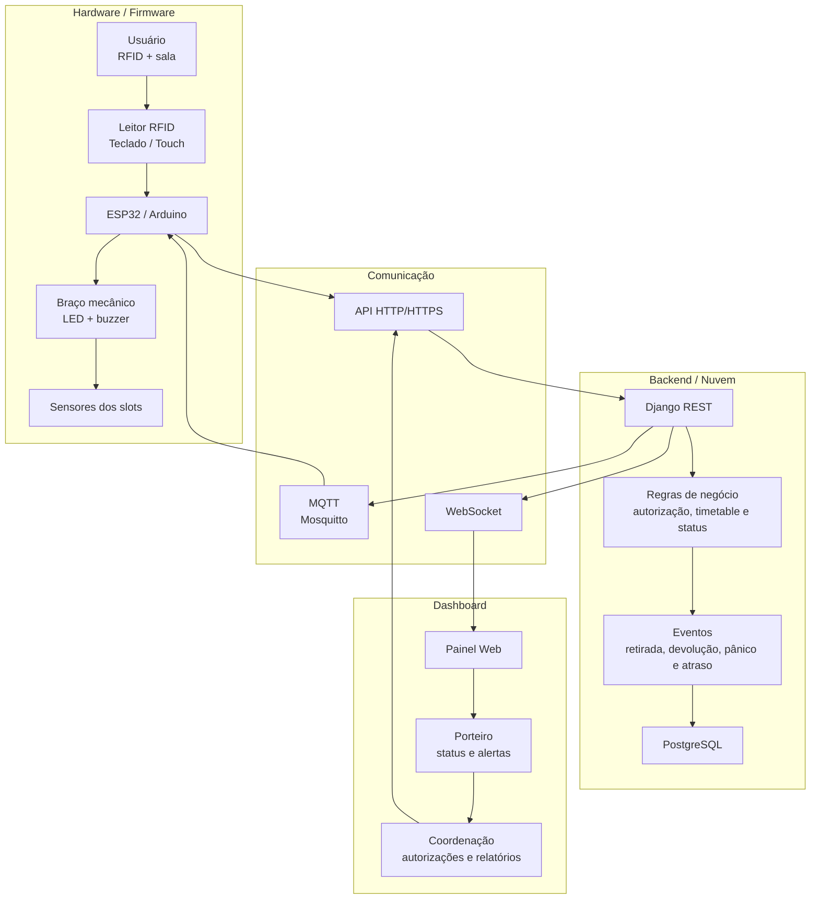
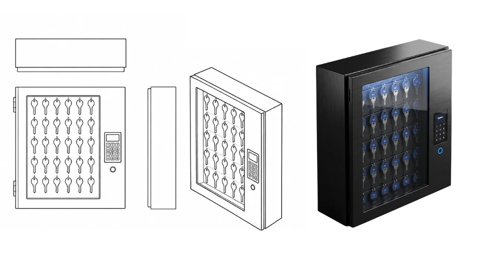

# Claviculário Automatizado

Sistema acadêmico para controle automatizado de retirada e devolução de chaves. A solução integra identificação por RFID, firmware em ESP32, regras de autorização, registro de eventos e um dashboard de acompanhamento em tempo real.

## Objetivo

Substituir o controle manual de chaves por uma solução segura, rastreável e de baixo custo para as dependências da Faculdade Senac. O sistema busca reduzir perdas, atrasos na liberação de salas e falhas no controle de acesso.

### Benefícios esperados

- Agilidade na retirada e devolução de chaves.
- Rastreabilidade de usuário, chave, sala, data e horário.
- Acesso restrito conforme papel, timetable e autorizações temporárias.
- Localização organizada das chaves e acompanhamento remoto pelo dashboard.


## Stack

| Camada | Tecnologias |
| --- | --- |
| Hardware e firmware | ESP32-C3, Arduino, RFID, teclado, display, LED, buzzer, sensores e motores |
| Backend | Python, Django, Django REST Framework e Simple JWT |
| Tempo real e tarefas | Django Channels, WebSocket, Redis e Celery |
| Dados | SQLite no ambiente local e PostgreSQL no Docker |
| Comunicação | HTTP, WebSocket e MQTT com Eclipse Mosquitto |
| Infraestrutura | Docker, Docker Compose e Daphne |
| Frontend | React, JavaScript, Vite, Tailwind CSS |

## Arduino e IoT

### Arquitetura documentada

O ESP32 centraliza a interação local do claviculário. O teclado matricial e os sensores utilizam GPIO; o display utiliza I2C; LEDs e buzzer fornecem retorno visual e sonoro; e o Wi-Fi permite a comunicação com o servidor. O fluxo previsto autentica o usuário, valida a solicitação, indica a posição da chave e registra retirada ou devolução.

### Estado atual do firmware

O diretório `ESP32-C3-tecladinho/` contém um protótipo em C++ para Arduino, preparado para simulação no Wokwi. Atualmente ele possui:

- leitura de teclado matricial 4x4;
- display LCD 16x2 via I2C;
- controle de dois LEDs pelos códigos `01` e `02`;
- feedback sonoro com buzzer;
- desligamento automático dos LEDs após 30 segundos;
- conexão Wi-Fi e requisições HTTP para horário e clima.

O RFID ainda está representado por uma variável simulada. A biblioteca `MFRC522` está listada, mas a leitura física do cartão, a comunicação com o backend, o MQTT e o controle do braço mecânico ainda não estão implementados nesse firmware.

## Arquitetura

O fluxograma apresenta como as tecnologias e as principais camadas do sistema interagem:



## Fluxo funcional

1. O usuário se identifica por RFID ou interface local.
2. Seleciona a sala ou chave desejada.
3. O sistema valida usuário, horário, autorização e disponibilidade.
4. O claviculário indica e libera a chave correta.
5. Retirada, devolução, negativa, atraso e pânico são registrados com timestamp.
6. O dashboard recebe as atualizações em tempo real.

## Estrutura física do claviculário

### Visão da maquete



### Demonstração do mecanismo


### Viabilidade

O protótipo utiliza componentes modulares e acessíveis, como ESP32, teclado, display, sensores e LEDs. A documentação estima custo eletrônico inferior a R$ 200, sem considerar a estrutura física, facilitando manutenção e expansão para novos slots.

## Como executar

### Pré-requisitos

- Python 3.12 ou superior
- [uv](https://docs.astral.sh/uv/)
- Node.js e npm
- Docker e Docker Compose para executar a infraestrutura completa

### Ambiente local

Esta opção utiliza SQLite e o canal WebSocket em memória. Na raiz do projeto, execute o backend:

```bash
uv sync
uv run python manage.py migrate
uv run python manage.py runserver
```

Em outro terminal, execute o frontend:

```bash
cd front-claviculario-main
npm install
npm run dev
```

- API: `http://127.0.0.1:8000/api/`
- Dashboard: `http://127.0.0.1:5173/`

### Docker Compose

Esta opção inicia a infraestrutura completa, incluindo PostgreSQL, Redis, Celery e Mosquitto.

```bash
docker compose up --build -d
docker compose exec web uv run python manage.py migrate
```

## Estrutura principal

```text
config/                    Configurações Django, Celery e WebSocket
usuarios/                  Usuários, papéis e identificação RFID
salas/                     Cadastro das salas
chaves/                    Chaves, slots e estados de ocupação
autorizacoes/              Autorizações temporárias
timetable/                 Horários de professores
operacoes/                 Retirada, devolução, pânico e atrasos
eventos/                   Auditoria e publicação em tempo real
relatorios/                Consultas e relatórios operacionais
hardware/                  Endpoints de integração com o ESP32
core/                      Permissões, views comuns e testes integrados
front-claviculario-main/   Dashboard em React, Vite e Tailwind CSS
ESP32-C3-tecladinho/       Protótipo do firmware
```

## Funcionalidades atuais

- Login com perfis de coordenação e porteiro.
- Status das chaves e histórico atualizados via WebSocket.
- Cadastro de usuários, salas, chaves e papéis.
- Autorizações temporárias para professores e alunos, com revogação.
- Registro de retiradas, devoluções, atrasos, pânico e autorizações.
- Porteiro com acesso somente ao Dashboard e às Salas.

## Boas práticas

- Use `uv add <pacote>` para adicionar dependências Python.
- Não versione `.env`, `.venv`, `db.sqlite3`, tokens ou credenciais.
- Execute as migrações antes de iniciar o servidor.
- Mantenha regras de negócio nos serviços, sem concentrá-las nas views.
- Faça commits pequenos, descritivos e relacionados a uma única alteração.

## Contexto acadêmico

Projeto Integrador do 4º período de Análise e Desenvolvimento de Sistemas da Faculdade SENAC.

**Equipe:** Andrew Kauê, Josué Oliveira, Luiz Miguel, Maria Eduarda, Matheus Ferreira, Victor Sette e Vinicius Cândido.
